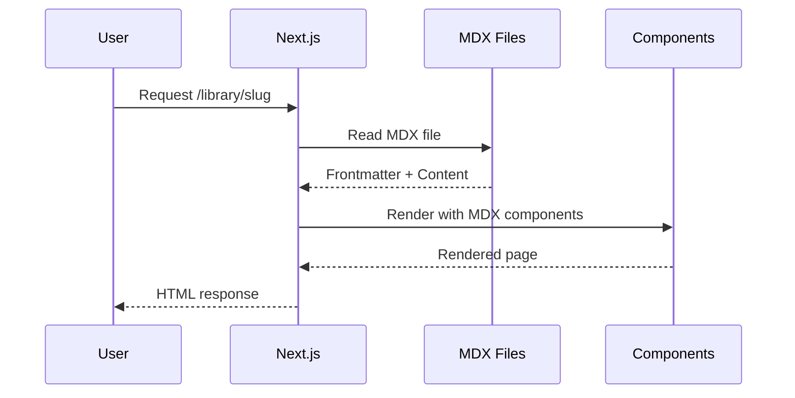

# Alvaro Blog V2 - Architecture Documentation

## Overview

This is a personal portfolio and blog website built with Next.js, featuring a **Dark Fantasy RPG theme** inspired by Elden Ring, Legend of Zelda, Warhammer, and Gundam. The site is designed as an interconnected world of "Realms" where visitors explore different aspects of the creator's life and work.

## Current Status

**Project Phase**: Active Development  
**Last Updated**: February 2026  
**Architecture**: App Router (migrated from Pages Router)  
**Theme**: Dark Fantasy with Realm-based navigation

---

## Tech Stack

### Core Framework
- **Next.js 16.1.6** - React framework with App Router architecture
- **React 19.2.4** - UI library
- **TypeScript 5.9.3** - Type-safe JavaScript

### Styling
- **Tailwind CSS 4.1.18** - Utility-first CSS framework (v4 migration complete)
- **DaisyUI 5.5.18** - Tailwind component library
- **@tailwindcss/typography 0.5.19** - Prose styling for blog content

### UI Components
- **shadcn/ui** - Radix UI-based component library (customized for dark fantasy theme)
- **Lucide React 0.563.0** - Icon library
- **Framer Motion 12.31.1** - Animation library
- **React Icons 5.5.0** - Additional icons

### Content Management
- **MDX** - Markdown with JSX for blog posts
  - @mdx-js/loader 3.0.1
  - @mdx-js/react 3.0.1
  - @next/mdx 16.1.6
  - next-mdx-remote 5.0.0
- **gray-matter 4.0.3** - Frontmatter parsing
- **reading-time 1.5.0** - Reading time calculation
- **remark-gfm 4.0.0** - GitHub Flavored Markdown
- **rehype-prism-plus 2.0.0** - Syntax highlighting

### Theming
- **next-themes 0.4.6** - Dark/light mode support (dark mode default)

### Other Utilities
- **date-fns 4.1.0** - Date manipulation
- **clsx 2.1.1** - Conditional class names
- **tailwind-merge 2.6.0** - Merge Tailwind classes
- **class-variance-authority 0.7.1** - Component variants
- **react-share 5.2.2** - Social sharing buttons

---

## Project Structure

```
alvaro-blog-v2/
├── public/                     # Static assets
│   ├── background/            # Background images
│   ├── logoIcons/             # Technology/skill icons
│   └── media/                 # Profile photos and media
├── content/
│   └── blog/                  # MDX blog posts
├── plans/                     # Architecture and planning documents
│   ├── visual-upgrade-dark-fantasy.md
│   └── realm-layers-architecture.md
├── src/
│   ├── @types/                # TypeScript type definitions
│   │   └── schema.d.ts        # Blog post types
│   ├── app/                   # Next.js App Router
│   │   ├── layout.tsx         # Root layout with providers
│   │   ├── page.tsx           # Home page (The Sanctum)
│   │   ├── globals.css        # Dark Fantasy theme CSS
│   │   ├── loading.tsx        # Global loading state
│   │   ├── error.tsx          # Global error boundary
│   │   ├── not-found.tsx      # 404 page
│   │   ├── robots.ts          # SEO robots.txt
│   │   ├── sitemap.ts         # SEO sitemap
│   │   ├── about/             # Character Sheet page
│   │   ├── blog/              # Blog listing & posts
│   │   │   ├── page.tsx       # Blog listing
│   │   │   └── [slug]/        # Individual blog post
│   │   ├── forge/             # Professional realm
│   │   ├── workshop/          # Creative realm
│   │   ├── tavern/            # Personal realm
│   │   ├── library/           # Knowledge realm
│   │   │   ├── page.tsx       # Library listing
│   │   │   └── [slug]/        # Individual scroll
│   │   ├── map/               # Realm navigation map
│   │   ├── projects/          # Projects page
│   │   ├── services/          # Services page
│   │   └── api/               # API routes
│   ├── components/
│   │   ├── ui/                # shadcn/ui components (dark fantasy styled)
│   │   │   ├── button.tsx
│   │   │   ├── card.tsx
│   │   │   ├── badge.tsx
│   │   │   ├── progress.tsx
│   │   │   └── ...
│   │   ├── effects/           # Visual effects
│   │   │   └── ember-particles.tsx
│   │   ├── layouts/           # Layout components
│   │   │   ├── Header.tsx     # Navigation header
│   │   │   ├── Footer.tsx     # Site footer
│   │   │   ├── Layout.tsx     # Main layout wrapper
│   │   │   └── RealmLayout.tsx # Realm-specific layout
│   │   ├── sections/          # Page sections
│   │   │   ├── Hero.tsx       # Home hero section
│   │   │   ├── about/         # About page sections
│   │   │   │   ├── character-stats.tsx
│   │   │   │   ├── hero.tsx
│   │   │   │   └── skill-tree/ # Gamified skill display
│   │   │   ├── contact/       # Contact form section
│   │   │   ├── products/      # Products section
│   │   │   ├── projects/      # Projects showcase
│   │   │   ├── services/      # Services offerings
│   │   │   └── support/       # Support section
│   │   └── alvaroUI/          # Custom UI components
│   ├── hooks/                 # Custom React hooks
│   │   └── use-toast.ts       # Toast notification hook
│   ├── lib/                   # Utility libraries
│   │   ├── utils.ts           # Common utilities
│   │   ├── fonts.ts           # Font configuration
│   │   ├── blog.ts            # Blog utilities
│   │   └── realms.ts          # Realm configuration
│   ├── services/              # External service integrations
│   ├── styles/                # Additional styles
│   └── utils/                 # Utility functions
│       ├── config.ts          # App configuration
│       ├── skills.ts          # Skills data
│       └── tools.ts           # Tools data
├── agent.md                   # Agent guidelines
├── architecture.md            # This file
├── technical-guidelines.md    # Code conventions
├── next.config.mjs            # Next.js configuration
├── postcss.config.mjs         # PostCSS configuration
├── tailwind.config.js         # Tailwind configuration (v4)
├── tsconfig.json              # TypeScript configuration
└── package.json               # Dependencies and scripts
```

---

## Architecture Diagram

```mermaid
graph TB
    subgraph Client
        Browser[Browser]
    end

    subgraph NextJS[Next.js App Router]
        subgraph Realms[Realm Pages]
            Sanctum[🏰 / - The Sanctum]
            Forge[⚔️ /forge - The Forge]
            Workshop[🎮 /workshop - The Workshop]
            Tavern[🍺 /tavern - The Tavern]
            Library[📚 /library - The Library]
            Map[🗺️ /map - The Map]
        end

        subgraph Core[Core Pages]
            About[/about - Character Sheet]
            Blog[/blog - Blog]
            Projects[/projects]
            Services[/services]
        end

        subgraph Components
            Layout[Root Layout]
            Header[Header]
            Footer[Footer]
            UI[shadcn/ui Components]
            Effects[Visual Effects]
            Sections[Page Sections]
        end

        subgraph API[API Routes]
            HelloAPI[/api/hello]
        end
    end

    subgraph Content[Content Layer]
        MDX[MDX Files]
    end

    Browser --> NextJS
    Realms --> Layout
    Core --> Layout
    Layout --> Header
    Layout --> Footer
    Layout --> Sections
    Sections --> UI
    Sections --> Effects

    Library --> MDX
    Blog --> MDX
```

---

## The Realms Architecture

The site is organized into interconnected "Realms" - each representing a different aspect of the creator's life and work:

### 🏰 The Sanctum (Home)
- **URL**: `/`
- **Purpose**: Central hub, personal castle/headquarters
- **Atmosphere**: Epic, welcoming, mysterious entrance
- **Visual**: Golden accents, floating ember particles, void background

### ⚔️ The Forge (Professional)
- **URL**: `/forge`
- **Purpose**: Professional work, career, services
- **Atmosphere**: Industrial, powerful, craftsmanship
- **Visual**: Ember orange, molten metal, spark effects

### 🎮 The Workshop (Creative)
- **URL**: `/workshop`
- **Purpose**: Game development, creative projects, experiments
- **Atmosphere**: Inventive, playful, experimental
- **Visual**: Ethereal blues, blueprint patterns, holographic overlays

### 🍺 The Tavern (Personal)
- **URL**: `/tavern`
- **Purpose**: Personal life, hobbies, community
- **Atmosphere**: Warm, inviting, social
- **Visual**: Amber tones, wood textures, candlelight effects

### 📚 The Library (Knowledge)
- **URL**: `/library`
- **Purpose**: Technical blog, tutorials, learning
- **Atmosphere**: Scholarly, mysterious, ancient wisdom
- **Visual**: Deep blues, parchment textures, dust particles

### 🗺️ The Map
- **URL**: `/map`
- **Purpose**: Visual overview of all realms
- **Atmosphere**: Adventure, discovery, exploration
- **Visual**: Fantasy map aesthetic, parchment texture

---

## Design System

### Color Palette

```css
/* Dark Fantasy Base */
--bg-void: #0a0a0f;           /* Deep void black */
--bg-dark: #12121a;           /* Dark background */
--bg-surface: #1a1a24;        /* Card/surface background */

/* Golden Accents (Elden Ring inspired) */
--gold-primary: #c9a227;      /* Primary gold */
--gold-light: #e8c547;        /* Light gold (hover) */
--gold-dark: #8b7019;         /* Dark gold (pressed) */

/* Blood/Fire Accents (Warhammer inspired) */
--crimson: #8b0000;           /* Deep crimson */
--ember: #ff4500;             /* Ember orange */

/* Ethereal Blues (Zelda inspired) */
--ethereal-blue: #4a9eff;     /* Magic blue */
--ice-blue: #87ceeb;          /* Ice/frost */

/* Rarity System */
--rarity-common: gray
--rarity-uncommon: green
--rarity-rare: blue
--rarity-epic: purple
--rarity-legendary: gold
```

### Typography

| Font | Usage |
|------|-------|
| **Cinzel** | Fantasy headings, titles, RPG elements |
| **Inter** | Body text, navigation, modern UI |
| **JetBrains Mono** | Code, stats, technical content |

---

## Data Flow

### MDX Content Flow



---

## Key Features

### 1. Home Page (The Sanctum)
- Hero section with profile image and golden glow ring
- Level indicator and character class
- Featured projects showcase
- Floating ember particles
- Portal-like navigation to realms

### 2. About Page (Character Sheet)
- RPG-style character panel
- Animated stat bars (HP, MP, EXP)
- Interactive skill tree with glowing connections
- Equipment/specialization display
- Character lore sections

### 3. Blog/Library
- MDX-powered content
- Tag filtering
- Reading time display
- Syntax highlighting
- Social sharing buttons
- Scroll/parchment styling

### 4. Projects (Quest Log)
- Achievement-style project cards
- Rarity system (Common → Legendary)
- XP rewards display
- Difficulty indicators
- Technology badges

---

## Configuration

### Environment Variables
```env
# Analytics (optional)
GOOGLE_ANALYTICS_TRACKING_ID=

# Revalidation (optional)
REVALIDATE_SECRET=
```

### Image Domains Configured
- www.notion.so
- images.unsplash.com
- prod-files-secure.s3.us-west-2.amazonaws.com

---

## Completed Migrations

### ✅ App Router Migration
- Migrated from Pages Router to App Router
- Implemented root layout with providers
- Added loading and error states
- Created sitemap.ts and robots.ts

### ✅ Tailwind CSS v4 Migration
- Updated to Tailwind CSS 4.1.18
- Using new @import syntax
- Configured @theme for custom properties
- Updated PostCSS configuration

### ✅ Visual Upgrade (Dark Fantasy)
- Implemented dark fantasy color palette
- Added custom fonts (Cinzel, Inter, JetBrains Mono)
- Created realm-specific backgrounds
- Added glow effects and animations
- Implemented rarity system styling

### ✅ Realm Architecture
- Created realm page structure
- Implemented realm-specific layouts
- Added navigation between realms

---

## In Progress

### 🔄 Content Migration
- [ ] Migrate existing blog posts to MDX
- [ ] Create content for each realm
- [ ] Add project data

### 🔄 Component Enhancement
- [ ] Complete skill tree interactivity
- [ ] Add more particle effects
- [ ] Implement achievement system

---

## Future Enhancements

### Short-term
1. Complete realm content population
2. Add more visual effects per realm
3. Implement cross-realm activity feed
4. Add unified search

### Medium-term
1. Add achievement/badge system
2. Implement character stats integration
3. Add interactive realm map
4. Performance optimization

### Long-term
1. Add authentication for admin features
2. Implement contact form backend
3. Add newsletter subscription
4. Consider headless CMS integration

---

## Performance Targets

| Metric | Target |
|--------|--------|
| Lighthouse Performance | > 90 |
| First Contentful Paint | < 1.5s |
| Largest Contentful Paint | < 2.5s |
| Cumulative Layout Shift | < 0.1 |

---

## Related Documents

- [`PLAN.md`](PLAN.md) — Development plan and task checklist
- [`agent.md`](agent.md) — Core cognitive agent guidelines
- [`technical-guidelines.md`](technical-guidelines.md) — Code conventions and patterns
- [`plans/visual-upgrade-dark-fantasy.md`](plans/visual-upgrade-dark-fantasy.md) — Visual design specifications
- [`plans/realm-layers-architecture.md`](plans/realm-layers-architecture.md) — Realm system details

---

*Last Updated: February 2026*
*Version: 2.0*
