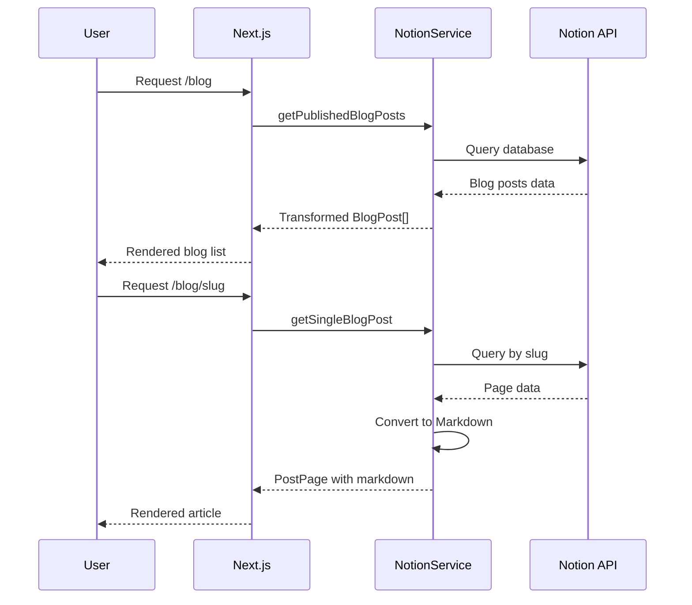

# Alvaro Blog V2 - Architecture Documentation

## Overview

This is a personal portfolio and blog website built with Next.js, featuring a modern tech stack with Notion as a headless CMS for blog content management.

## Tech Stack

### Core Framework
- **Next.js 15.1.4** - React framework with Pages Router architecture
- **React 19.0.0** - UI library
- **TypeScript 5.7.3** - Type-safe JavaScript

### Styling
- **Tailwind CSS 3.4.17** - Utility-first CSS framework
- **DaisyUI 4.12.10** - Tailwind component library
- **tailwindcss-animate 1.0.7** - Animation utilities
- **@tailwindcss/typography 0.5.9** - Prose styling for blog content

### UI Components
- **shadcn/ui** - Radix UI-based component library (extensive set of components)
- **Lucide React 0.469.0** - Icon library
- **Framer Motion 11.16.4** - Animation library
- **React Icons 5.3.0** - Additional icons

### Content Management
- **Notion API (@notionhq/client 2.2.15)** - Headless CMS for blog posts
- **notion-to-md 3.1.1** - Convert Notion blocks to Markdown
- **react-markdown 9.0.1** - Render Markdown content

### Forms & Validation
- **React Hook Form 7.54.2** - Form management
- **@hookform/resolvers 3.10.0** - Validation resolvers
- **Zod 3.24.1** - Schema validation

### Payments (Integrated but possibly unused)
- **Stripe (@stripe/stripe-js 5.5.0, stripe 17.5.0)** - Payment processing

### Backend Services
- **Firebase 10.14.0** - Backend services (auth, database, etc.)

### SEO & Analytics
- **next-seo 6.6.0** - SEO management
- **Google Analytics** - Analytics tracking (via config)

### Theming
- **next-themes 0.4.4** - Dark/light mode support

### Other Utilities
- **date-fns 4.1.0** - Date manipulation
- **clsx 2.1.1** - Conditional class names
- **tailwind-merge 2.6.0** - Merge Tailwind classes
- **class-variance-authority 0.7.1** - Component variants
- **react-share 5.1.0** - Social sharing buttons
- **sonner 1.7.1** - Toast notifications
- **recharts 2.15.0** - Charts library
- **embla-carousel-react 8.5.2** - Carousel component
- **vaul 1.1.2** - Drawer component

---

## Project Structure

```
alvaro-blog-v2/
├── public/                     # Static assets
│   ├── background/            # Background images
│   ├── logoIcons/             # Technology/skill icons
│   └── media/                 # Profile photos and media
├── src/
│   ├── @types/                # TypeScript type definitions
│   │   └── schema.d.ts        # Blog post types
│   ├── components/
│   │   ├── alvaroUI/          # Custom UI components
│   │   ├── layouts/           # Layout components
│   │   │   ├── Layout.tsx     # Main layout wrapper
│   │   │   ├── Header.tsx     # Navigation header
│   │   │   └── Footer.tsx     # Site footer
│   │   ├── sections/          # Page sections
│   │   │   ├── about/         # About page sections
│   │   │   │   └── skill-tree/# Gamified skill display
│   │   │   ├── contact/       # Contact form section
│   │   │   ├── products/      # Products section
│   │   │   ├── projects/      # Projects showcase
│   │   │   ├── services/      # Services offerings
│   │   │   └── support/       # Support section
│   │   └── ui/                # shadcn/ui components
│   ├── hooks/                 # Custom React hooks
│   │   └── use-toast.ts       # Toast notification hook
│   ├── lib/                   # Utility libraries
│   │   └── utils.ts           # Common utilities
│   ├── pages/                 # Next.js Pages Router
│   │   ├── _app.tsx           # App wrapper
│   │   ├── _document.tsx      # Document customization
│   │   ├── index.tsx          # Home page
│   │   ├── about/             # About page
│   │   ├── api/               # API routes
│   │   ├── blog/              # Blog pages
│   │   │   ├── index.tsx      # Blog listing
│   │   │   └── [slug].tsx     # Individual blog post
│   │   ├── projects/          # Projects page
│   │   └── services/          # Services page
│   ├── services/              # External service integrations
│   │   └── notion-services.ts # Notion API client
│   ├── styles/                # Global styles
│   │   └── globals.css        # Tailwind + CSS variables
│   └── utils/                 # Utility functions
│       ├── config.ts          # App configuration
│       ├── index.ts           # General utilities
│       ├── skills.ts          # Skills data
│       └── tools.ts           # Tools data
├── next.config.js             # Next.js configuration
├── tailwind.config.js         # Tailwind configuration
├── tsconfig.json              # TypeScript configuration
├── .eslintrc.json             # ESLint configuration
└── package.json               # Dependencies and scripts
```

---

## Architecture Diagram

```mermaid
graph TB
    subgraph Client
        Browser[Browser]
    end

    subgraph NextJS[Next.js Application]
        subgraph Pages[Pages Router]
            Home[/ - Home]
            About[/about]
            Blog[/blog]
            BlogPost[/blog/slug]
            Projects[/projects]
            Services[/services]
        end

        subgraph Components
            Layout[Layout Component]
            Header[Header]
            Footer[Footer]
            UI[shadcn/ui Components]
            Sections[Page Sections]
        end

        subgraph API[API Routes]
            HelloAPI[/api/hello]
        end
    end

    subgraph External[External Services]
        Notion[Notion CMS]
        GA[Google Analytics]
        Firebase[Firebase]
        Stripe[Stripe]
    end

    Browser --> NextJS
    Pages --> Layout
    Layout --> Header
    Layout --> Footer
    Layout --> Sections
    Sections --> UI

    BlogPost --> Notion
    Blog --> Notion
    Home --> GA
    Services --> Stripe
```

---

## Data Flow

### Blog Content Flow



---

## Key Features

### 1. Home Page
- Hero section with profile image
- Featured projects showcase
- Services overview
- Service products display
- Process section
- Contact section

### 2. About Page
- Hero section with personal info
- Gamified skill tree display
  - Skills organized by category
  - Level progression system
  - Experience points visualization
  - Skill dependencies/unlocks

### 3. Blog
- Notion-powered content management
- Tag filtering
- Search functionality
- Pagination
- Social sharing buttons
- Markdown rendering with prose styling

### 4. Projects
- Project cards with:
  - Title and description
  - Technology tags
  - GitHub links

### 5. Services
- Service hero section
- Service cards with pricing
- Products section
- Process workflow display

---

## Configuration

### Environment Variables Required
```env
NOTION_ACCESS_TOKEN=        # Notion integration token
NOTION_BLOG_DATABASE_ID=    # Notion database ID for blog
GOOGLE_ANALYTICS_TRACKING_ID=  # GA tracking ID
```

### Image Domains Configured
- www.notion.so
- images.unsplash.com
- alphaxperience.io

---

## Current Issues & Technical Debt

### Build Configuration
- **ESLint ignored during builds** - `ignoreDuringBuilds: true`
- **TypeScript errors ignored** - `ignoreBuildErrors: true`
- These settings mask potential issues

### Code Quality
- Some `@ts-ignore` comments present
- Console.log statements in production code
- Mixed use of `"use client"` directive (Pages Router doesn't need it)
- Duplicate SEO handling (both `next-seo` and manual `<Head>` tags)

### Type Safety
- `BlogPost.featured` property defined but not used in transformer
- Some `any` types in Notion service

### Unused/Commented Code
- Products and Contact routes commented out in navigation
- Support section commented out on home page
- Old index and globals files present

### Potential Improvements
- No error boundaries
- No loading states for data fetching
- No image optimization strategy
- No caching strategy beyond ISR
- No testing setup

---

## Deployment

Currently configured for deployment on:
- **Netlify** (based on URL in config: alvaro-blog.netlify.app)
- **Vercel** compatible (standard Next.js setup)

---

## Version Information

| Package | Current Version | Latest Stable |
|---------|----------------|---------------|
| Next.js | 15.1.4 | 15.x |
| React | 19.0.0 | 19.x |
| TypeScript | 5.7.3 | 5.x |
| Tailwind CSS | 3.4.17 | 3.x / 4.x |

---

## Recommended Upgrade Paths

### Short-term
1. Fix TypeScript and ESLint errors
2. Remove console.log statements
3. Clean up unused code and files
4. Implement proper error handling

### Medium-term
1. Migrate from Pages Router to App Router
2. Implement proper loading and error states
3. Add testing infrastructure
4. Optimize images and performance

### Long-term
1. Add authentication for admin features
2. Implement contact form backend
3. Add newsletter subscription
4. Consider Tailwind CSS v4 migration
